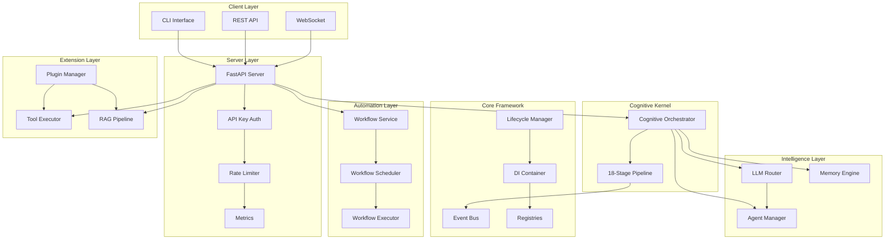
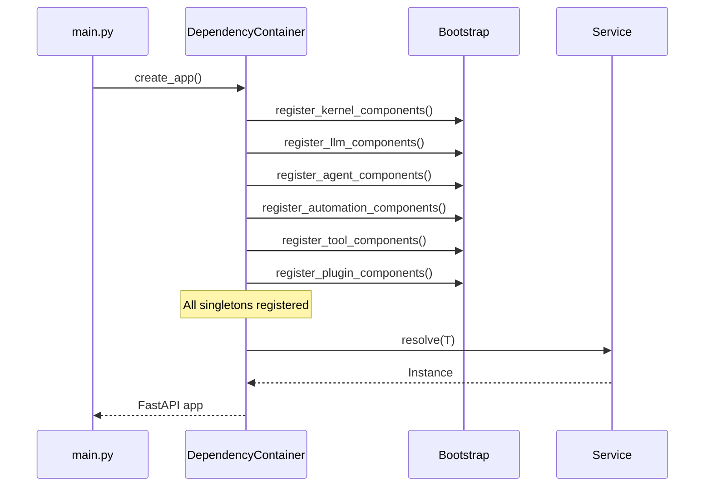
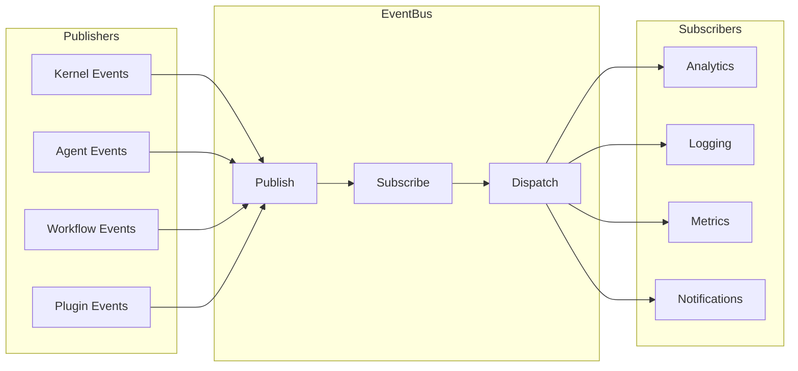
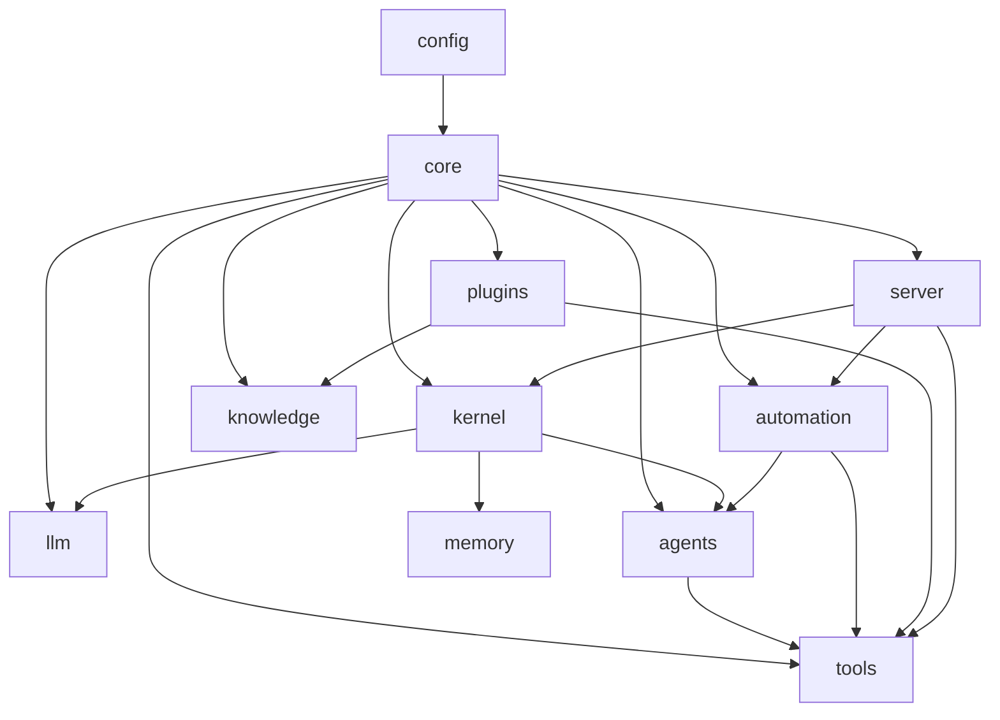
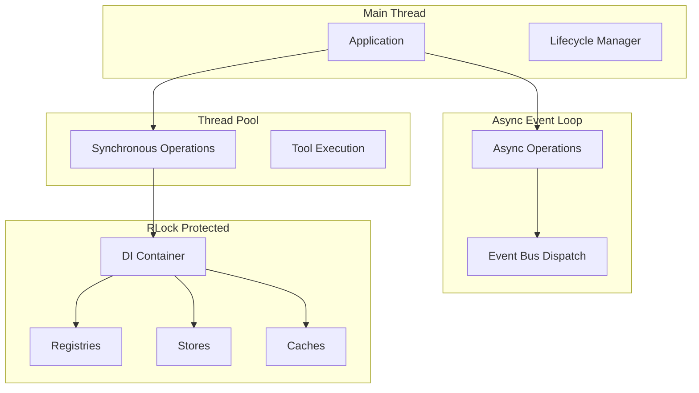
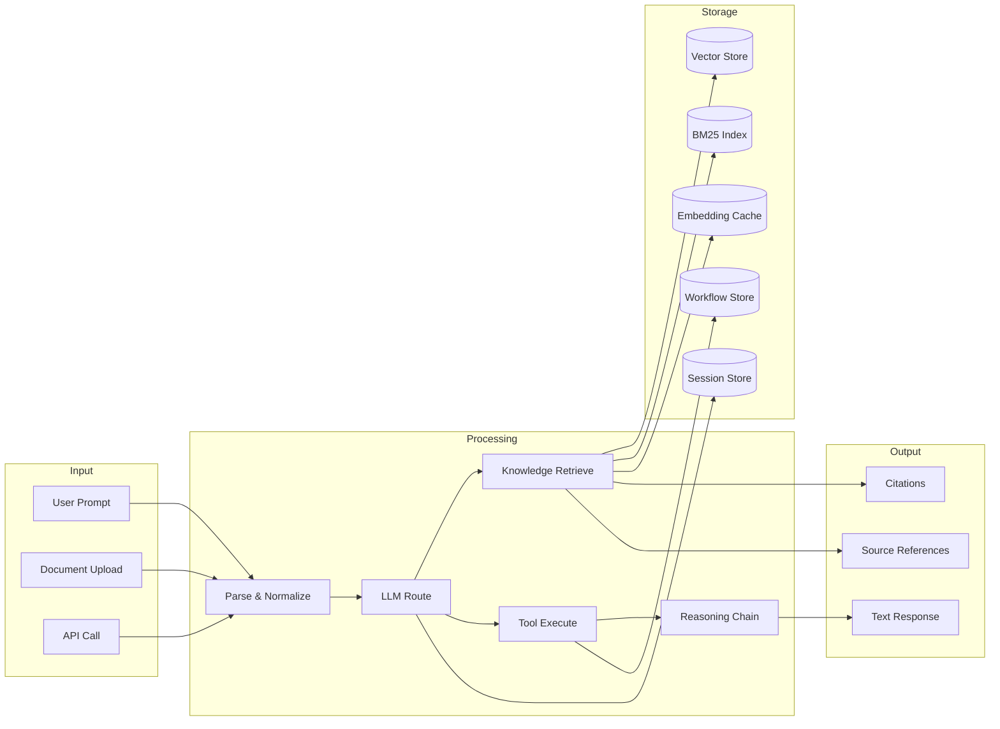

# Architecture

## System Overview

GeneralAI is a modular, plugin-extensible AI platform built around a cognitive kernel, multi-LLM routing, and enterprise RAG capabilities.

## High-Level Architecture

## Cognitive Pipeline

The cognitive kernel processes requests through 18 stages:

```mermaid
graph LR
    Input[User Input] --> Perception[Perception]
    Perception --> Intent[Intent]
    Intent --> Goals[Goals]
    Goals --> Planning[Planning]
    Planning --> Reasoning[Reasoning]
    Reasoning --> Decision[Decision]
    Decision --> Capability[Capability]
    Capability --> Policy[Policy]
    Policy --> Skills[Skill Selection]
    Skills --> ToolResolve[Tool Resolution]
    ToolResolve --> ToolExec[Tool Execution]
    ToolExec --> Reflection[Reflection]
    Reflection --> Experience[Experience]
    Experience --> Context[Context]
    Context --> State[State]
    State --> Model[Model Router]
    Model --> Response[Response Builder]
    Response --> Output[Output]
```

## Dependency Injection Flow

## Event Bus Architecture

## Module Dependencies

## Threading Model

## Data Flow

