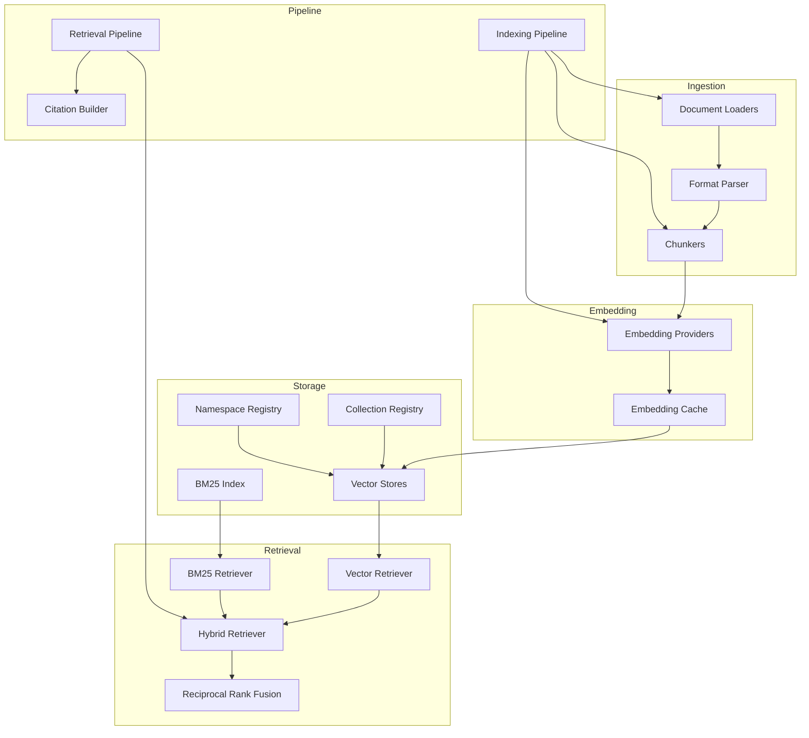

# Knowledge & RAG System

## Overview

The Knowledge module provides enterprise document ingestion, embedding, indexing, and retrieval. It supports multiple document formats, chunking strategies, embedding providers, and vector stores.

## Architecture



## Document Formats

| Format | Loader | Dependencies |
|---|---|---|
| TXT | `TextLoader` | stdlib |
| Markdown | `MarkdownLoader` | stdlib |
| JSON | `JsonLoader` | stdlib |
| CSV | `TextLoader` | stdlib |
| PDF | `PdfLoader` | pypdf (optional) |
| HTML | `HtmlLoader` | beautifulsoup4 (optional) |

## Chunking Strategies

| Strategy | Description |
|---|---|
| `FixedChunker` | Fixed-size character chunks with overlap |
| `SentenceChunker` | Split on sentence boundaries |
| `ParagraphChunker` | Split on paragraph boundaries |
| `RecursiveChunker` | Hierarchical structural splitting |

## Embedding Providers

| Provider | Description | Dependencies |
|---|---|---|
| `MockEmbeddingProvider` | Deterministic hash-based (default) | None |
| `SentenceTransformerEmbeddingProvider` | Local embeddings | sentence-transformers |

## Vector Stores

| Store | Description | Dependencies |
|---|---|---|
| `InMemoryVectorStore` | NumPy brute-force cosine | numpy |
| `FAISSVectorStore` | FAISS IndexFlatIP | faiss-cpu (optional) |
| `ChromaVectorStore` | ChromaDB backend | chromadb (optional) |

## Usage

### Initialize

```python
from app.core.container import DependencyContainer
from app.knowledge.bootstrap import register_knowledge_components

container = DependencyContainer()
register_knowledge_components(container)
```

### Ingest Documents

```python
pipeline = container.resolve(IndexingPipeline)

# Ingest from bytes
pipeline.ingest(
    b"Document content...",
    source_uri="document.txt",
    collection_id="my-docs",
    namespace="production",
)

# Ingest pre-parsed document
pipeline.ingest_document(document)
```

### Search

```python
# Simple search
results = pipeline.search(
    query="search query",
    collection_id="my-docs",
    namespace="production",
    top_k=10,
)

# Advanced search with filters
from app.knowledge.models import RetrievalQuery, MetadataFilter

query = RetrievalQuery(
    query="search query",
    collection_id="my-docs",
    namespace="production",
    filters=(
        MetadataFilter(field="format", op="eq", value="pdf"),
        MetadataFilter(field="date", op="gte", value="2026-01-01"),
    ),
    strategy="hybrid",
    top_k=10,
    vector_weight=0.7,
    bm25_weight=0.3,
)
```

### Retrieval Strategies

| Strategy | Description |
|---|---|
| `vector` | Dense vector similarity only |
| `bm25` | Sparse lexical matching only |
| `hybrid` | RRF fusion of vector + BM25 |

## Collections & Namespaces

- **Namespaces** isolate collections (e.g., `prod`, `staging`)
- **Collections** group related documents
- Each collection tracks its embedding model and vector store

## Analytics

```python
analytics = container.resolve(KnowledgeAnalytics)
summary = analytics.summary()

print(f"Embeddings created: {summary.embeddings_created}")
print(f"Cache hit rate: {summary.cache_hit_rate:.2%}")
print(f"Index size: {summary.index_size}")
print(f"Total queries: {summary.total_queries}")
```
