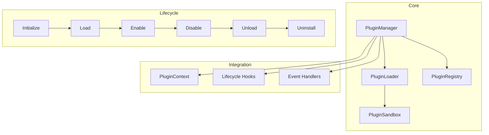

# Plugin System

## Overview

The plugin system allows extending GeneralAI with custom functionality. Plugins can register tools, API routes, event handlers, and lifecycle hooks.

## Architecture



## Plugin Lifecycle

| Stage | Description |
|---|---|
| `initialize` | Set up plugin resources |
| `install` | Register plugin components |
| `load` | Load plugin code |
| `enable` | Activate plugin |
| `disable` | Deactivate without unloading |
| `ununload` | Remove from memory |
| `uninstall` | Full cleanup |

## Plugin Types

| Type | Description |
|---|---|
| `TOOL` | Provides one or more tools |
| `AGENT` | Provides custom agent behavior |
| `WORKFLOW` | Provides workflow steps |
| `API_ROUTE` | Provides REST endpoints |
| `MEMORY_PROVIDER` | Provides memory backend |
| `LLM_PROVIDER` | Provides LLM backend |
| `MIXED` | Combination of the above |

## Creating a Plugin

```python
from app.plugins.base import PluginBase, PluginContext

class MyPlugin(PluginBase):
    name = "my-plugin"
    version = "1.0.0"
    description = "A custom plugin"

    async def initialize(self, context: PluginContext) -> None:
        """Set up resources."""
        self.context = context

    async def enable(self) -> None:
        """Register components."""
        if self.context.tool_registry:
            self.context.tool_registry.register(my_tool)

    async def disable(self) -> None:
        """Clean up."""
        pass
```

## Plugin Context

The `PluginContext` provides access to platform services:

```python
class PluginContext:
    tool_registry: ToolRegistry | None
    agent_manager: AgentManager | None
    provider_registry: ProviderRegistry | None
    memory_engine: MemoryEngine | None
    workflow_service: WorkflowService | None
    container: DependencyContainer | None
    fastapi_app: FastAPI | None
    logger: Logger | None
```

## Sandbox Security

Plugins execute in a restricted sandbox:

- Module import restrictions
- Filesystem access limits
- Network access controls
- Resource limits (memory, CPU)

## Configuration

```python
# Plugin directories (in order)
plugin_dirs = [
    Path("plugins"),           # Project-local
    Path("~/.generalai/plugins"),  # User-level
    Path("/opt/generalai/plugins"),  # System-level
]

# Allowed modules for sandbox
allowed_modules = {
    "json", "re", "math", "datetime", "collections",
}
```
